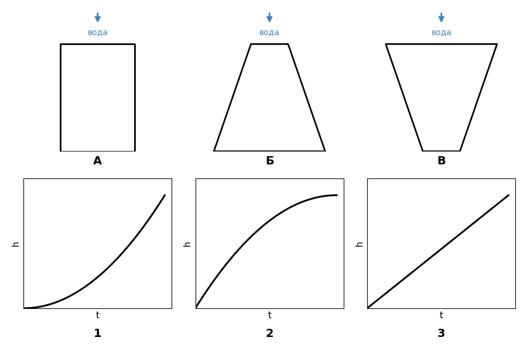
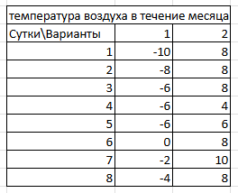

## Поступающие в 7 класс (проверка общей готовности)

- `(открытый, гипотеза)`

| 1 | 2 |
| --- | --- |
| При каком условии воздушный шар начинает движение вверх? | У чего выше температура: у кипятка или у водяного пара?  Объясните почему. |

- `(визуальный, на сопоставление)` На рисунке — три сосуда разной формы (А, Б, В), 
в которые наливают воду с постоянной скоростью, и три графика зависимости уровня воды от времени (1, 2, 3).
Определите, какой график соответствует какому сосуду. Объясните свой выбор.
<figure></figure>

- `(визуальный, чтение графика)` На графике — зависимость скорости от времени для двух велосипедистов. 
В какой примерный момент они поравняются? Опишите словами, как двигался каждый из них.
<figure><figcaption>Вариант 1</figcaption></figure>
<figure><figcaption>Вариант 2</figcaption></figure>

- `(визуальный, таблица↔график)` Дана таблица значений (например, температура воздуха в течение дня). 
Постройте по ней график. Подпишите оси.
<figure></figure>

## Поступающие в 8 класс (проверка курса 7 класса: давление, сила Архимеда, простые механизмы)

- `(визуальный, силы)` На рисунке изображён корабль, движущийся влево. Изобразите на рисунке стрелками: силу тяжести корабля, силу Архимеда, скорость корабля, силу трения (сопротивления воды).
<figure><figcaption>Вариант 1</figcaption></figure>
<figure><figcaption>Вариант 2</figcaption></figure>

- `(открытый, вывод единиц)`

| Вариант 1 | Вариант 2 |
| --- | --- |
| Зная, что \(p = F/S\), представьте паскали через метры, килограммы и секунды. | Почему острый нож режет лучше тупого, если прикладывать к ним одинаковую силу? Объясните через давление. |

- `(визуальный, рычаг)` На рисунке — рычаг с двумя грузами на разном расстоянии от точки опоры (расстояния и массы подписаны). Определите, уравновешен ли рычаг. Если нет — в какую сторону он повернётся и почему?
<figure><figcaption>Вариант 1</figcaption></figure>
<figure><figcaption>Вариант 2</figcaption></figure>

- `(визуальный, график)` На графике — зависимость массы от объёма для трёх веществ (А, Б, В), прямые выходят из начала координат. У какого вещества самая большая плотность? Как это видно по графику?
<figure><figcaption>Вариант 1</figcaption></figure>
<figure><figcaption>Вариант 2</figcaption></figure>

## Поступающие в 9 класс (проверка курса 8 класса: тепловые явления, электричество, оптика)

- `(визуальный, график нагревания)` На графике — зависимость температуры вещества от количества переданной теплоты, на графике видны 5 участков. Определите, какие процессы происходят на каждом участке (нагрев твёрдого тела, плавление, нагрев жидкости, кипение, нагрев пара).
<figure><figcaption>Вариант 1</figcaption></figure>
<figure><figcaption>Вариант 2</figcaption></figure>

- `(визуальный, схема цепи)` На рисунке — электрическая цепь с двумя лампами, соединёнными последовательно. Что произойдёт с яркостью второй лампы, если первая перегорит? Нарисуйте стрелками направление тока в цепи.
<figure><figcaption>Вариант 1</figcaption></figure>
<figure><figcaption>Вариант 2</figcaption></figure>

- `(открытый, ток)`

| Вариант 1 | Вариант 2 |
| --- | --- |
| Почему провод нагревается при прохождении электрического тока? Что произойдёт с выделяемым теплом, если силу тока увеличить в 2 раза? | Электрочайник передал воде некоторое количество теплоты. Почему температура воды растёт, пока вода не закипела, но во время кипения может не изменяться? Куда расходуется энергия? |

- `(визуальный, ход луча)` Изобразите на рисунке плоское зеркало и падающий на него луч света под углом 50° к нормали.

- `(открытый, термодинамика)`

| Вариант 1 | Вариант 2 |
| --- | --- |
| Почему металлическая ложка в горячем чае быстро нагревается, а деревянная — значительно медленнее? | Почему при сжатии воздуха в насосе он нагревается? |

## Поступающие в 10 класс (проверка курса 9 класса: кинематика, динамика, энергия)

- `(визуальный, скорость-ускорение)` На графике изображено изменение скорости тела со временем. Постройте рядом график зависимости ускорения от времени для этого же движения.
<figure><figcaption>Вариант 1</figcaption></figure>
<figure><figcaption>Вариант 2</figcaption></figure>

- `(визуальный, силы на наклонной плоскости)` На рисунке — брусок на наклонной плоскости с углом 30°. Изобразите все силы, действующие на брусок (без трения).
<figure><figcaption>Вариант 1</figcaption></figure>
<figure><figcaption>Вариант 2</figcaption></figure>

- `(открытый, вывод единиц)`

| Вариант 1 | Вариант 2 |
| --- | --- |
| Зная, что \(A = F \cdot s\), выразите джоуль через килограммы, метры и секунды. | Два лифта равномерно поднимаются на одинаковую высоту, но один делает это в 2 раза быстрее. У кого больше совершённая работа? У кого больше мощность? Объясните. |

- `(визуальный, график высоты → графики энергии)` На графике — зависимость высоты подброшенного мяча от времени (парабола). Постройте на основе этого графика зависимость кинетической энергии от времени и зависимость потенциальной энергии от времени.
<figure><figcaption>Вариант 1</figcaption></figure>
<figure><figcaption>Вариант 2</figcaption></figure>

- `(открытый, рассуждение без готовой формулы)`

| Вариант 1 | Вариант 2 |
| --- | --- |
| Два тела разной массы, но одинаковой формы, падают с одной высоты без сопротивления воздуха. У какого скорость раньше увеличится вдвое от начальной? Объясните с помощью второго закона Ньютона. | Тележку толкают с постоянной силой. Что произойдёт с её ускорением, если на тележку положить груз и увеличить её массу в 2 раза? |
